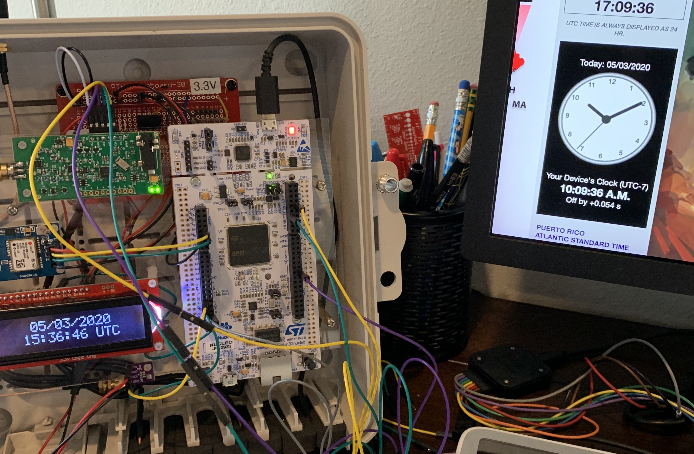

# STM32WXX - Work in Progress

An STM32 Nucleo-F429ZI FreeRTOS Wireless Weather Station written in C++

_Behold, Clock Drift_

## Bill of Materials

* [ARM Cortex M4 based STM32 Nucelo-F429ZI MCU](https://www.st.com/en/evaluation-tools/nucleo-f429zi.html)
* [u-blox NEO-6M GPS Receiver](https://www.u-blox.com/en/product/neo-6-series)
* [BMP280 Temperature, Humidity, Pressure Sensor](https://www.bosch-sensortec.com/products/environmental-sensors/humidity-sensors-bme280/)
* [Enhanced Radio Devices HamShield Mini 144/440 MHz Transceiver](https://inductivetwig.com/collections/hamshield-and-accessories/products/hamshield-mini)
* [SparkFun LCD-14073 Two Line LCD](https://www.sparkfun.com/products/14073)
* [Traco Power TSR12433 DC-DC 3.3v converter](https://www.tracopower.com/model/tsr-1-2433)

## Features

* Time and location synchronized to GPS
* Measures temperature, humidity and pressure
* Displays time, location, temperature, humidity and pressure on backlit LCD
* (Planned) Transmits weather data to [APRS](http://aprs.org/)

## Project Status

- [x] FreeRTOS project and tasks for Core, LCD, GPS, THP and Radio
- [x] Receive time and location from GPS
- [x] Receive temperature, humidity and pressure from THP device
- [x] Display time, location, temperature, humidity and pressure on LCD
- [ ] Create APRS AX.25 packets with weather data
- [ ] Transmit APRS packets
